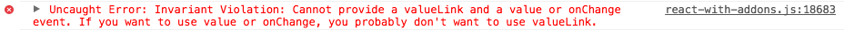

# Going big with React

从外界的听到的关于它的传言都是有误导的，React根本不是什么mvvm框架，只是带有丰富功能的，类似component概念的，具有良好生命周期设计的，可以通过JSX大大提高编码效率的—View，其中功能之一(插件形式)是mvvm而已，但他依然还是个View和其设计及组织View的理念。移动端用这个很是靠谱。

## React观点

* simple !== familiar

## TODO

* [重要 Streamlining React Elements](http://facebook.github.io/react/blog/2015/02/24/streamlining-react-elements.html)
* [H5 react-swiper](https://github.com/joakimbeng/react-swiper)
* [H5 react-tappable](https://github.com/JedWatson/react-tappable) [demo](http://jedwatson.github.io/react-tappable/)
* [immutable.js](http://facebook.github.io/immutable-js/)


## 官方文档

* [JSX进阶](http://facebook.github.io/react/docs/jsx-in-depth.html)
* [配套工具和教程(Complementary Tools)](https://github.com/facebook/react/wiki/Complementary-Tools)
* [JSX和HTML的区别](http://facebook.github.io/react/docs/jsx-gotchas.html) 里面讲到输出html的几种方法
   - [unicode工具](http://www.fileformat.info/info/unicode/char/search.htm) 很好的工具
   - [DOM Differences](http://facebook.github.io/react/docs/dom-differences.html)
* [关于children的key，重要](http://facebook.github.io/react/docs/multiple-components.html)
* [关于复用component](http://facebook.github.io/react/docs/reusable-components.html)
  - propTypes的验证规则
  - Mixin
* [Component Lifecycle](http://facebook.github.io/react/docs/working-with-the-browser.html#component-lifecycle) 
  - Mounting: A component is being inserted into the DOM.
  - Updating: A component is being re-rendered to determine if the DOM should be updated.
  - Unmounting: A component is being removed from the DOM.
* Forms
  - Controlled Components
  - Uncontrolled Components: An `<input>` that does not supply a value (or sets it to `null`) is an uncontrolled component. In an uncontrolled `<input>`, the value of the rendered element will reflect the user's input. 
  - `checkbox/radio`使用`defaultChecked`实现`Uncontrolled`
  - `textarea`的值必须使用value属性来设置
* 重要概念[Refs](http://facebook.github.io/react/docs/more-about-refs.html) 
* 捕获点击事件 `onClickCapture` 
* 必须掌握的知识点 [Multiple Components](http://facebook.github.io/react/docs/multiple-components.html)
* 必须掌握`textarea`的赋值

```
// WRONG
<textarea name="description">This is the description.</textarea>
// RIGHT
<textarea name="description" value="This is a description." />
```

* 必须掌握`select`的赋值

```
// WRONG
<select>
   <option value="foo" selected>Foo</option>
   <option value="boo">Boo</option>
</select>
// RIGHT notice the "value" attribute
<select value="foo">
   <option value="foo">Foo</option>
   <option value="boo">Boo</option>
</select>
```

对比事件处理

方法1：使用bind绑定参数

```
<span onClick={this.handleDelete.bind(this, this.props.id)}>
    删除
</span>
```

方法2：默认传入[event](http://facebook.github.io/react/docs/events.html)对象

```
<span onClick={this.handleDelete2} data-id={this.props.id}>
    删除
</span>
```
  
## 相关CommonJS工具

* [html to jsx](http://facebook.github.io/react/html-jsx.html)
* [browserify](http://browserify.org/)
* [webpack](http://webpack.github.io/)
* [flux](http://fluxxor.com/what-is-flux.html)
* [Reflux](https://github.com/spoike/refluxjs)：flux概念的一个优雅实现
* [react cdn](http://cdnjs.com/libraries/react/)

## 基于React实现的UI

* [React.js powered UI framework for developing beautiful hybrid mobile apps.](http://touchstonejs.io/)
* [React Hackathon toolkit](https://github.com/petehunt/ReactHack)
* [react-touch](https://github.com/petehunt/react-touch)
* [widgets](http://jquense.github.io/react-widgets/docs/#intro)
* [day picker](http://www.gpbl.org/react-day-picker/)
* [Imager.jsx](https://github.com/oncletom/Imager.jsx) 
* [Imager.js](https://github.com/BBC-News/Imager.js) responsive image solution

## 比较好的React教程

* [Removing User Interface Complexity, or Why React is Awesome](http://jlongster.com/Removing-User-Interface-Complexity,-or-Why-React-is-Awesome)
* [Complementary-Tools](https://github.com/facebook/react/wiki/Complementary-Tools#jsx-integrations)
* [awesome-react](https://github.com/enaqx/awesome-react) 这是一个react的资料大全 需要自己找精华
* [React TODO](http://todomvc.com/examples/react)

## Reactjs VS Angularjs

定位：

* React：A JAVASCRIPT LIBRARY FOR BUILDING USER INTERFACES
* Angular：

资料：

* [When To Use AngularJS And When You Should Use ReactJS](http://ilikekillnerds.com/2014/10/use-angularjs-use-reactjs/)
* [BirdWatch: AngularJS vs. ReactJS](http://matthiasnehlsen.com/blog/2014/03/31/birdwatch-with-reactjs/) 老外做的复杂项目的实现比较
* [Facebook's React vs AngularJS: A Closer Look](http://www.quora.com/Pete-Hunt/Posts/Facebooks-React-vs-AngularJS-A-Closer-Look) 用react和angular实现同样的功能，对比行数，概念
* [React.js and How Does It Fit In With Everything Else?](http://www.funnyant.com/reactjs-what-is-it/) 对于react的一些思考
* SPA实现对比：http://blog.celerity.com/react/flux-from-an-angularjs-perspective

Rating实现对比

* [by Angular](http://www.befundoo.com/university/tutorials/angularjs-directives-tutorial/)
* [by React](http://www.quora.com/Pete-Hunt/Posts/Facebooks-React-vs-AngularJS-A-Closer-Look)

## React-Router

* [各种情况的匹配说明：Path Matching](https://github.com/rackt/react-router/blob/master/docs/guides/path-matching.md)
* [Route](https://github.com/rackt/react-router/blob/master/docs/api/components/Route.md)
	
	```html
	<!-- `path` defaults to '/' since no name or path provided -->
<Route handler={App}>
  <!-- path is automatically assigned to the name since it is omitted -->
  <Route name="about" handler={About}/>
  <Route name="users" handler={Users}>
    <!--
      note the dynamic segment in the path, and that it starts with `/`,
      which makes it "absolute", or rather, it doesn't inherit the path
      from the parent route
    -->
    <Route name="user" handler={User} path="/user/:id"/>
  </Route>
</Route>
	```
	
## 关于Reflux的相当重要的注意点

* `Component`的生命周期是永远不会重叠，即生命周期和该生命周期的一切属性(props/state/methods)都是一一对应的。当上一个生命周期的方法(比如`addItem`)没有执行完成时，即使`Store`层分发了新的数据，该Component的state数据和从Stroe获取的数据都一定是被触发时所对应的生命周期的数据，而不是新数据。


## 其他

* [MDN Javascript](https://developer.mozilla.org/en-US/docs/Web/JavaScript)
  - [Spread operator](https://developer.mozilla.org/en-US/docs/Web/JavaScript/Reference/Operators/Spread_operator) React中`{...props}`写法的来源
* [HTML5shim](https://github.com/aFarkas/html5shiv)
* [console-polyfill](https://github.com/paulmillr/console-polyfill/blob/master/index.js)


## 细节

* 关于升级的优雅提示 https://gist.github.com/sebmarkbage/ae327f2eda03bf165261#
* 当`value/onChange`和`valueLink`同时使用的时候，在控制台的提示。



## 起步样板库

https://github.com/celerityweb/react-flux-boilerplate

## 可以参考的站点样式

* http://www.thinkmill.com.au/

## 工具

* https://github.com/reactjs/sublime-react

## 动态

* https://github.com/emberjs/rfcs/pull/15
* http://talks.erikbryn.com/htmlbars-emberconf/#/

## Offline Transform

安装

```
npm install -g react-tools
```

监听

```
jsx --watch jsx/ src/
激活ES7的语法
jsx --watch --harmony jsx/ src/
```